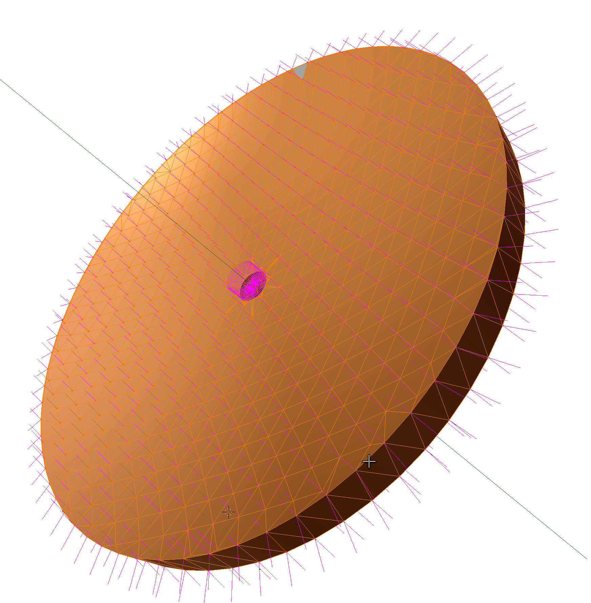
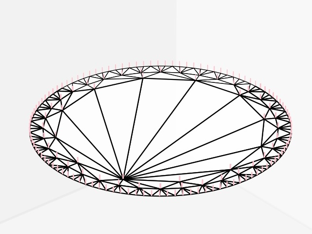
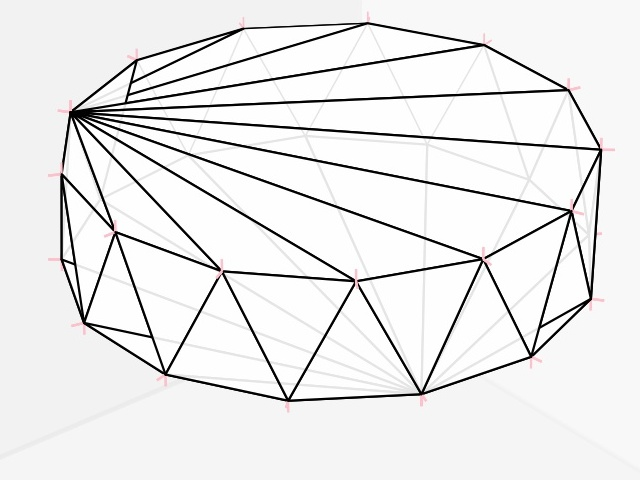
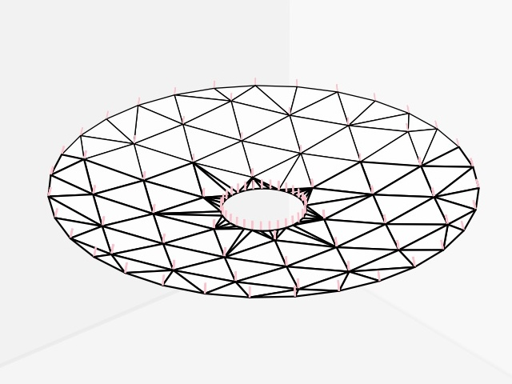
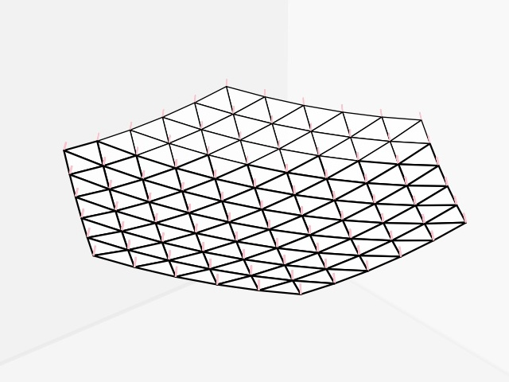
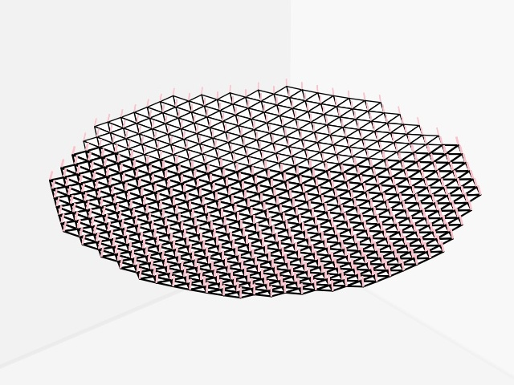
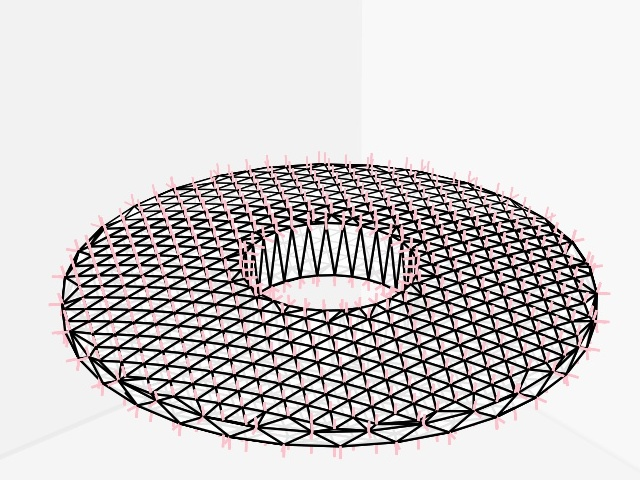
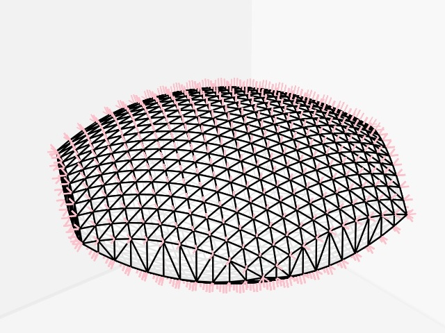
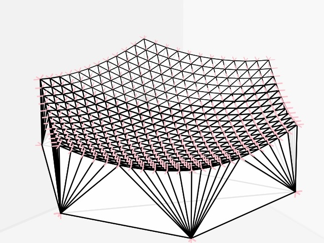

Optic Object Wavefronts
=======================
A python-library to create triangle-meshes with vertex-normals of optics such as lenses and mirrors.
Use common computer-aided-design for all easy, non optical components where surface-normals do not matter.
But when surface-normals matter, use this library to creatre meshes with accurate vertex-normals.

disc
----

cylinder
--------

spherical_cap_regular
---------------------

spherical_cap_hexagonal
-----------------------

spherical_cap_pixels
--------------------

spherical_lens
--------------

spherical_lens_hexagonal
------------------------

spherical_planar_lens_hexagonal
-------------------------------

