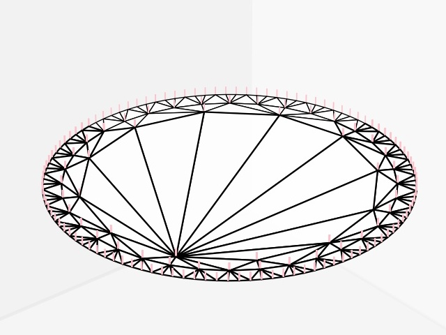
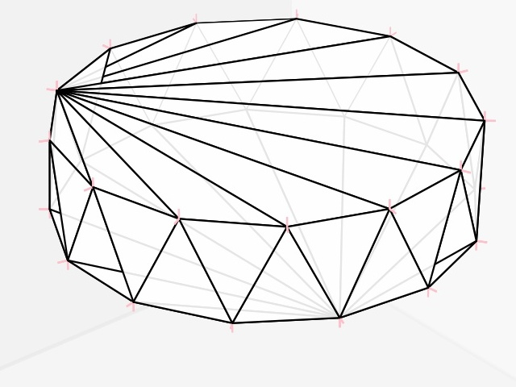
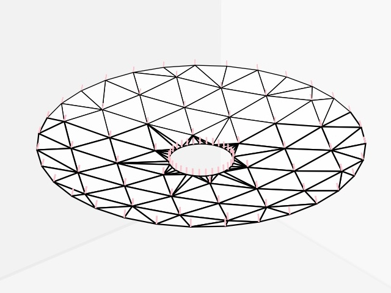
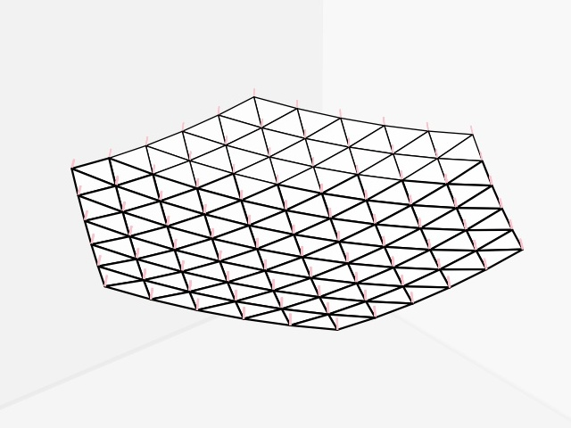
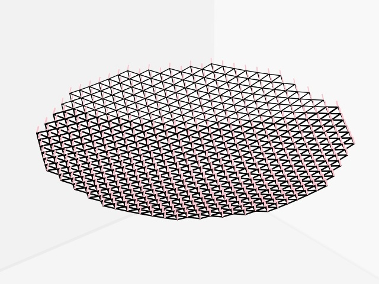
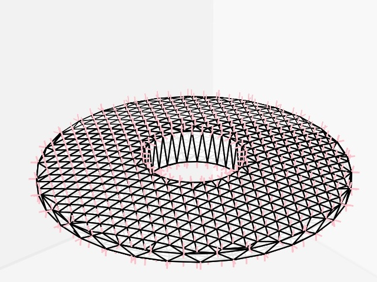
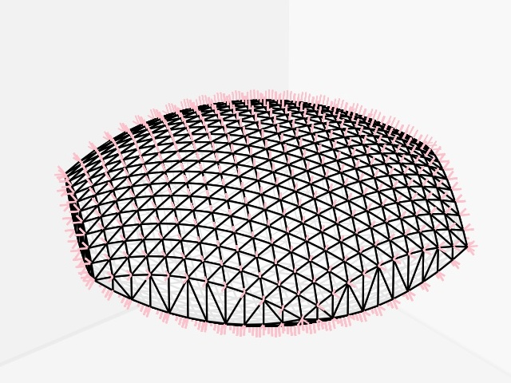
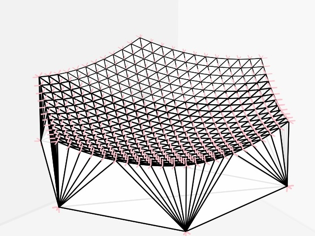

Optic Object Wavefronts
=======================
A python-library to create triangle-meshes with vertex-normals of optics such as lenses and mirrors.
Use common computer-aided-design for all easy, non optical components where surface-normals do not matter.
But when surface-normals matter, use this library to creatre meshes with accurate vertex-normals.

Disc
----

Cylinder
--------

SphericalCapRegular
-------------------

SphericalCapHexagonal
---------------------

SphericalCapPixels
------------------

SphericalLens
------------

SphericalLensHexagonal
----------------------

SphericalPlanarLensHexagonal
-------------------------------

